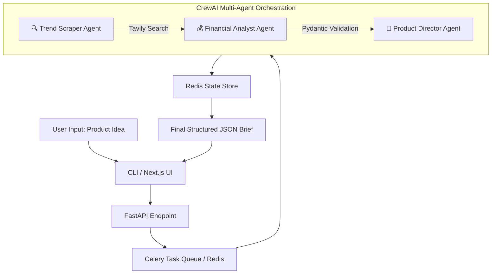

# 🧠 Enterprise Multi-Agent Market Intelligence Engine


> An asynchronous, decoupled CrewAI orchestration engine that automates deep-dive market research, competitor price benchmarking, and unit-economics modeling—transforming 3 weeks of manual research into 60 seconds of agentic reasoning.

## 🎯 The Core Idea

**The Problem:** Founders and product managers spend weeks manually scraping competitor websites, calculating hypothetical margins, and writing go-to-market strategies. Freelance consultants charge $5,000–$10,000 for a single market sizing report.

**The Solution:** This project codifies that consulting workflow into three specialized AI agents. You type in a product idea (e.g., "Smart Water Bottle"), and the system autonomously:
1. Scrapes the web for real competitor pricing.
2. Estimates realistic Cost of Goods Sold (COGS).
3. Synthesizes a complete launch brief with a 90-day roadmap.

---

## ✨ Key Features

- **Three-Agent Orchestration:** Trend Scraper → Financial Analyst → Product Director (sequential, deterministic handoffs).
- **Financial Guardrails:** Strict Pydantic schemas enforce numeric outputs (margin %, COGS, retail price), preventing the LLM from hallucinating non-sensical business logic.
- **Sub-second LLM Inference:** Leverages **Groq LPUs** (Llama 3.3 70B) for high-speed, open-weight reasoning—cutting API costs by ~80% compared to GPT-4.
- **Real-time Web Grounding:** Utilizes **Tavily API** to fetch up-to-date competitor data, ensuring the AI relies on real-world numbers rather than outdated training data.
- **Enterprise-Grade Blueprint:** Structured with FastAPI + Celery + Redis in mind, designed to handle non-blocking task dispatch for simultaneous research queries.

---

## 🏗️ Architecture & Workflow



**Data Flow Breakdown:**
1. **Trend Scraper:** Executes web searches for existing competitors, pricing tiers, and market trends.
2. **Financial Analyst:** Parses search results to estimate COGS. Calculates suggested retail price and gross margin percentage. Enforces financial logic via Pydantic.
3. **Product Director:** Synthesizes the data into an executive summary, identifies target demographics, drafts competitive positioning, defines a 90-day launch timeline, and highlights risk mitigations.


## 💡 Why This Project?

**The Honest Truth:** 
This project doesn't replace a dedicated market research firm—it replaces the *discovery phase*. It gives you a 70% complete foundation in 60 seconds, allowing humans to focus on the strategic "why" rather than the mechanical "what is the competition charging?"

**Engineering Motivation:**
This repository serves as a practical demonstration of:
- **Agentic Design Patterns:** How to chain specialized LLM agents with deterministic tool calls.
- **Cost-Efficient AI:** Using open-weight models (Llama 3.3) on specialized hardware (Groq) to achieve enterprise-grade reasoning at consumer-grade prices.
- **API Abstraction:** Wrapping web search APIs (Tavily) into standardized CrewAI tools.

---

## 🎯 Who Is This For?

| Role | Value |
| :--- | :--- |
| **Solopreneurs / Founders** | Validate product viability without paying $10k for a consulting report. |
| **Product Managers** | Rapidly benchmark competitors before writing PRDs. |
| **Students / Researchers** | Study the mechanics of multi-agent LLM orchestration. |
| **Hackathon Teams** | Generate instant business plans to pitch alongside your prototype. |

---

## ⚠️ Honest Limitations (Read Before Using)

Transparency is critical in AI. Currently, the system has three known bottlenecks:

1. **COGS Hallucination:** The Financial Analyst sometimes confuses raw material costs with finished goods. For example, it estimated a physical ceramic "coffee cup" at $0.12 (whereas real manufacturing is $2.50+). **Mitigation:** Manual validation of physical goods is still required, or a future "Manufacturing Estimator" agent.
2. **Freshness Reliance:** The quality of the report depends entirely on the Tavily search results. If the web has no data on your niche (e.g., a truly novel product), the agents will attempt to extrapolate from adjacent markets.
3. **Latency:** The sequential agent chain takes 20-45 seconds per query—optimized for asynchronous background tasks, not real-time chat.

---

## 📦 Requirements

- **Python 3.9+**
- **API Keys Required:**
  - [Groq API Key](https://console.groq.com/) (for LLM inference)
  - [Tavily API Key](https://tavily.com/) (for real-time web search)

---

## 🚀 Quick Start (Local Setup)

**1. Clone the Repository**
```bash
git clone https://github.com/your_username/market-intel-crew.git
cd market-intel-crew
```

**2. Set up a Virtual Environment**
```bash
python -m venv .venv
source .venv/bin/activate  # Windows: .venv\Scripts\activate
```

**3. Install Dependencies**
```bash
pip install -r requirements.txt
```

**4. Configure Environment Variables**
Create a `.env` file in the root directory and add your keys:
```env
GROQ_API_KEY=gsk_xxxxxxxxxxxxxxxxxxxxxxxx
TAVILY_API_KEY=tvly-xxxxxxxxxxxxxxxxxxxxxxxx
```

**5. Run the CLI Demo**
```bash
python main.py
# Follow the prompt: "Enter your product idea:"
```


## 📁 Project Structure

```
.
├── app/
│   ├── agents/
│   │   ├── trend_scraper.py      # Tavily search logic
│   │   ├── financial_analyst.py  # Pydantic margin models
│   │   └── product_director.py   # Brief synthesis
│   ├── tasks/
│   │   └── crew_tasks.py         # Task definitions
│   └── utils/
│       └── validators.py         # Pydantic schemas
├── main.py                       # CLI Entry Point
├── requirements.txt
└── .env.example


## 🛣️ Future Roadmap

While the CLI works today, the architecture is designed for scale:

- [ ] **API Gateway:** Expose endpoints via FastAPI.
- [ ] **Async Queue:** Implement Celery/Redis for non-blocking job submission.
- [ ] **Report Generation:** Export to PDF via `weasyprint`.
- [ ] **JSON Validation:** Add automatic retries if the Financial Analyst returns invalid financials.


## 🤝 Contributing

This project is currently a snapshot of a working Agentic AI flow. As a self-contained prototype, it is closed to direct contributions for now, but feel free to fork and experiment with your own agents!


## 📄 License

Distributed under the MIT License. See `LICENSE` for more information.

**Built with:** ❤️ by Shivam Singh — Because market research shouldn't cost $10,000.
```
